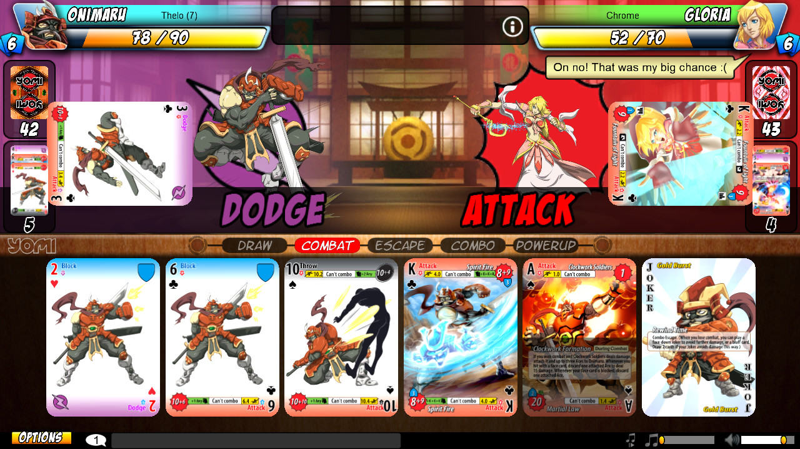

# Cartas - ruby

El objetivo de este ejercicio es familiarizarse con el uso de ruby y el IDE.

## Antes de empezar: algunos consejos

El enunciado tiene **mucha** información, van a necesitar leerlo varias veces. La sugerencia es que lo lean entero una vez (para tener una idea general) y luego vuelvan a consultarlo las veces que hagan falta.

Concéntrense en los **requerimientos** y, excepto que se traben mucho, respeten el orden sugerido. Sería interesante que vayan creando las distintas clases y métodos a medida que resuelven cada requerimiento y no antes.

## Descripción del dominio

Una reconocida marca de juegos de cartas se puso en contacto con nosotros para desarrollar la primera versión digital de su famoso juego de combate.

### Cartas

Las cartas son el elemento clave del juego. Y la marca nos pasó los siguientes requerimientos:

- Las cartas poseen los siguientes atributos que sólo pueden modificarse desde dentro de la misma carta: _nombre_, _ataque_, _defensa_ y _vida_ (respetar el orden de los parámetros en la inicialización). Además, cada carta posee un _id_ (valor entero incremental empezando en 1) que no se repite en ninguna otra carta.
- Las cartas tienen que poder **atacar_a(_defensor_)**, en donde se hace que la otra reciba el ataque pasándose a sí misma como parámetro.
- Las cartas reciben el ataque de otras cartas a través de **atacado_por(_atacante_)**. Lo que sucede acá es que su _vida_ disminuye en el mismo valor que la diferencia entre el _ataque_ del atacante y la _defensa_ del defensor. Este método devuelve la _vida_ restante de la carta que recibió el ataque.
- Como puede verse, si son ataques unilaterales es bastante injusto, por lo que nos piden definir **turno_pelea(_defensor_)**. En dicho turno, primero ataca la carta que inició la acción, y luego ataca la otra. Este método retorna el sobreviviente de dicho turno (de sobrevivir únicamente uno) o **nil** (si sobreviven ambas cartas).
- Por último, las cartas deben entender **pelear_con(_defensor_)**. Acá es cuando las cartas batallan entre sí, alternando quién ataca primero, hasta que una sea la ganadora (carta que debe devolver el método).

Como hay cartas muy comunes en este juego, se necesita una forma simple de poder obtenerlas, con los valores ya definidos.

- **guerrero**: Nombre: "Guerrero", Ataque: 60, Defensa: 45, Vida: 100.
- **ninja**: Nombre: "Ninja", Ataque: 65, Defensa: 40, Vida: 100.
- **pistolero**: Nombre: "Pistolero", Ataque: 70, Defensa: 30, Vida: 100.

### Jugador

Ahora tenemos a los jugadores, que son quienes poseen su mazo de cartas, un criterio para ordenarlo y otro criterio para seleccionar una carta a descartar (este criterio se usa al si al agregar una nueva carta, se supera el límite del mazo). Además, el jugador contiene un **límite** (**10**) para la cantidad de cartas que puede tener en su poder. Dicho límite es el mismo para todos los jugadores.

Se necesita que el jugador pueda agregar una carta a su mazo, utilizando **agregar_carta(_carta_)**. Teniendo en cuenta que no puede repetirse la misma carta en el mazo (en cuyo caso se debe arrojar un error), como también el límite del mazo. De alcanzar el límite del mazo y querer agregar una nueva carta, el jugador debe utilizar el criterio de descarte para determinar qué carta descartar (existe la posibilidad que la carta a descartar sea la nueva carta). Luego de agregar la carta, el mazo debe quedar ordenado según su criterio de orden.

Por otro lado, el jugador debe comprender **descartar(_carta_)**, en donde debe eliminar dicha carta de su mazo. Si la carta no existiera en el mazo, se debe arrojar un error.

- #### Criterio de Descarte

Un criterio de descarte determina una del mazo para descartarla (removerla del mazo).

Algunos criterios de descarte a desarrollar son:
- **menor_vida**: Descartar la carta que posea menor vida.
- **menor_id**: Descarta la carta con menor id, porque asume que las cartas más viejas son obsoletas.
- **última**: Descarta la última carta del mazo (recordando que el mazo debe estar ordenado).

Para utilizar el criterio de descarte, el mismo debe poder entender **carta_descarte(_mazo_)**, que debe retornar la carta a descartar o **nil** si el mazo está vacío.

- ### Criterio de orden

El jugador debe poder **ordenar_mazo**, en donde su mazo queda ordenado según el criterio de orden que tenga en ese momento. Para esto el criterio debe poder entender **ordenar(_mazo_)**, en donde dicho criterio devuelve el mazo ordenado.

Algunos criterios de orden a desarrollar son:
- **mejor_araque**: Donde las cartas con mejor ataque quedan primero.
- **delta_ataque_defensa**: Donde quedan primero las cuya diferencia entre ataque y defensa sea mayor.
- **literal**: Donde las cartas se ordenan por nombre.
- **matemático**: Donde se utiliza el siguiente cálculo. El doble del ataque menos dos tercios de la defensa; todo esto multiplicado por la mitad de la vida. Y a ese número, sumarle el resto de la longitud del nombre divido cuatro.

El jugador tiene la posibilidad de cambiar su criterio de orden sin problema, para esto debe comprender **criterio_orden=(_nuevo_criterio_)**. Al realizarse dicha modificación se debe reordenar el mazo.

### Jugador Pro

Es un jugador que al haber pagado una suma de dinero inicial, ha podido aumentar la cantidad de cartas que puede tener en su poder. El nuevo límite de cartas aumenta en 1 por cada $10 que haya abonado.

Por el momento no es posible que un Jugador existente se convierta en Jugador Pro, ni que el Jugador Pro pueda realizar otro pago para seguir aumentando su límite del mazo.

### Batalla

Ahora que ya tenemos definidas las cartas y los jugadores, es momento de armar una batalla. La única responsabilidad de una batalla es poder hacer que 2 jugadores se enfrenten. Para esto debe poder entender **batallar(_jugador1_, _jugador2_)**, en donde cada jugador selecciona sus mejores (según su criterio de orden) 5 cartas (o menos si no llega a 5) para batallar. En la batalla se utiliza una carta hasta que se quede sin vida (el jugador pierde/descarta dicha carta), y luego utiliza la próxima. Al jugar una nueva carta, ésta comienza el próximo ataque. Al invocar este método, se debe retornar al vencedor de la batalla.

### Torneo

Para incentivar a la gente a sumarse al juego, se crean los torneos (arrancan en 4tos de final). Los mismos pueden crearse ya listos para arrancar o a la espera de jugadores que se inscriban (**agregar_jugador(_jugador_)**).

Al **iniciar** el torneo, se realizan los combates de a pares, quedando 1 jugador eliminado por batalla, y el vencedor pasa a la siguiente ronda. El ganador recibe una nueva carta, definida en el momento de la creación del torneo. Si se invoca a **iniciar** y el mismo no tiene la cantidad correcta de jugadores, el método debe arrojar un error.

## Requerimientos

### Etapa 1

Desarrollar el modelo de Carta, que comprenda los siguientes métodos:

1. **atacar_a(_defensor_)**.
2. **atacado_por(_atacante_)**.
3. **turno_pelea(_defensor_)**.
4. **pelear_con(_defensor_)**.
5. Creación de las cartas comunes.

### Etapa 2

1. Desarrollar Criterio de Descarte con **carta_descarte(_mazo_)** y Criterio de Orden con **ordenar(_mazo_)**.
2. Crear los criterios de Descarte y Orden definidos en la descripción del dominio.

### Etapa 3

Desarrollar el modelo de Jugador con los siguientes métodos:

1. **agregar_carta(_carta_)**.
2. **descartar(_carta_)**.
3. **ordenar_mazo**.
4. **criterio_orden=(_nuevo_criterio_)**.

### **BONUS:** Etapa 4

1. Desarrollar el modelo Jugador Pro.
2. Definir la Batalla y el método **batallar(_jugador1_, _jugador2_)**.
3. Definir el modelo de Torneo con los métodos **agregar_jugador(_jugador_)** e **iniciar**.

## Créditos

Se agradece la participación de Federico Aloi por sus comentarios y aporte al enunciado.
